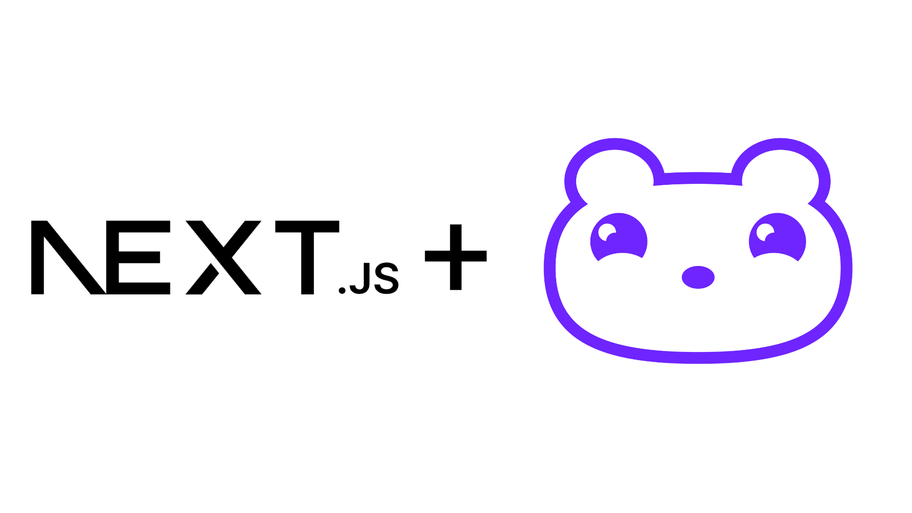

# Next.js for Multinite.

This project is made for Multinite's public pages.

## Getting Started

All bash commands are unmodified:

Development:
```bash
npm run dev
```

Building:
```bash
npm run build
```

Serving:
```bash
npm run start
```

## Next.js Documentation

[Next.js App router docs](https://nextjs.org/docs/app)


## Multinite Documentation

[Multinite Public Page docs](https://dev.multinite.com/public_page/nextjs)